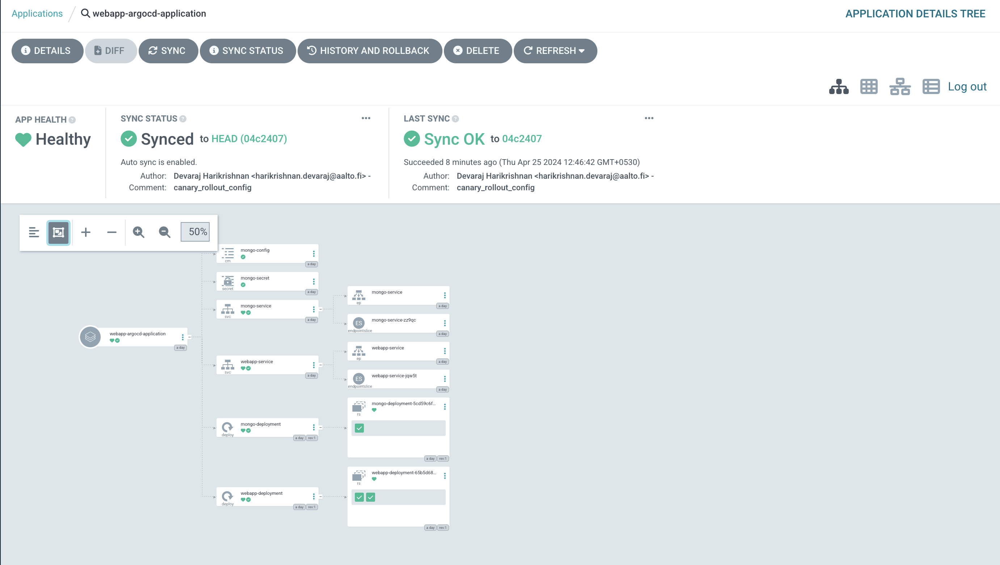
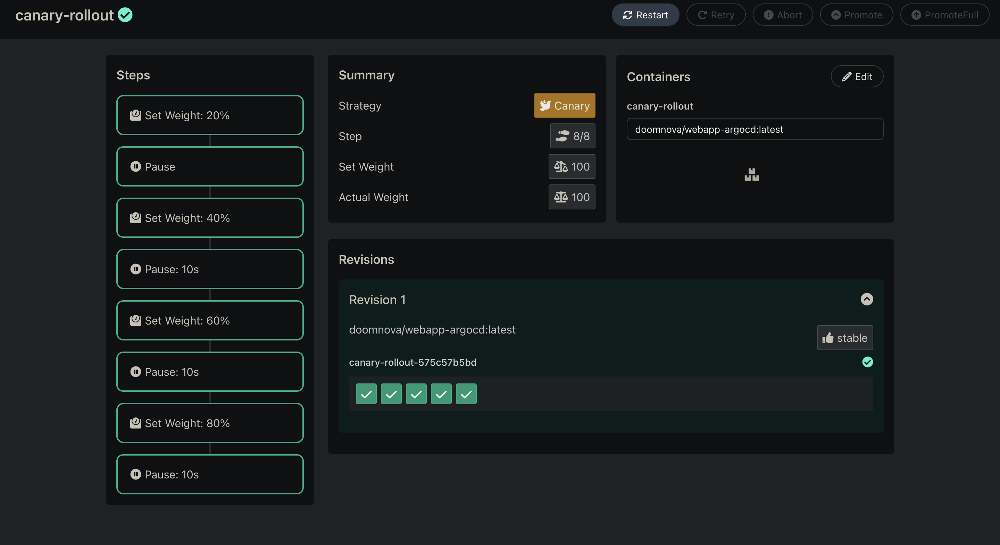
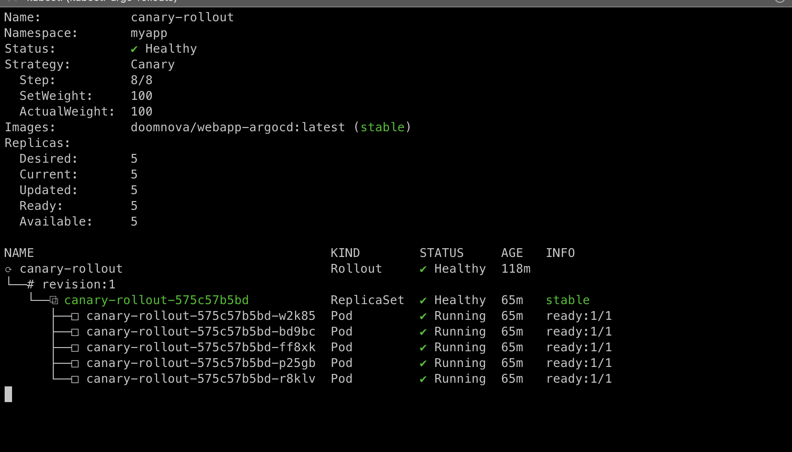
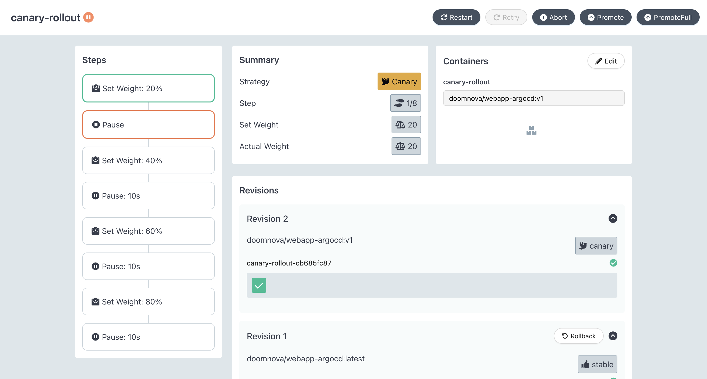
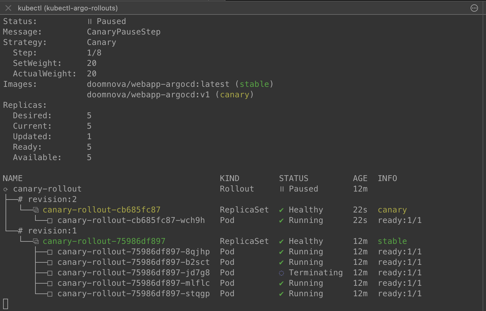
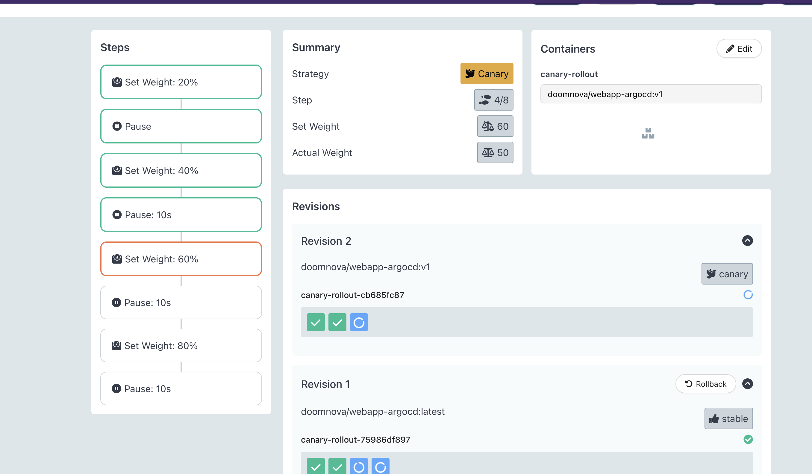
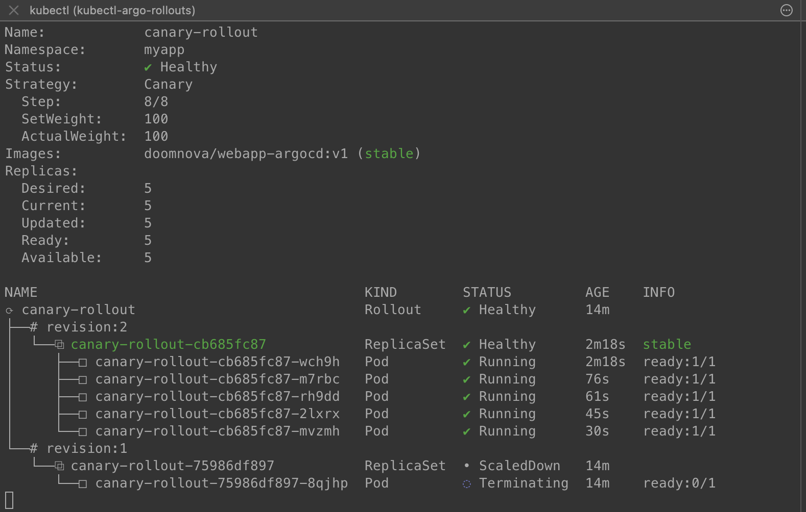

<!-- Improved compatibility of back to top link: See: https://github.com/othneildrew/Best-README-Template/pull/73 -->
<a name="readme-top"></a>
<!--
*** Thanks for checking out the Best-README-Template. If you have a suggestion
*** that would make this better, please fork the repo and create a pull request
*** or simply open an issue with the tag "enhancement".
*** Don't forget to give the project a star!
*** Thanks again! Now go create something AMAZING! :D
-->


<!-- PROJECT SHIELDS -->
<!--
*** I'm using markdown "reference style" links for readability.
*** Reference links are enclosed in brackets [ ] instead of parentheses ( ).
*** See the bottom of this document for the declaration of the reference variables
*** for contributors-url, forks-url, etc. This is an optional, concise syntax you may use.
*** https://www.markdownguide.org/basic-syntax/#reference-style-links
-->
<!--[![Contributors][contributors-shield]][contributors-url]
[![Forks][forks-shield]][forks-url]
[![Stargazers][stars-shield]][stars-url]
[![Issues][issues-shield]][issues-url]
[![MIT License][license-shield]][license-url]
[![LinkedIn][linkedin-shield]][linkedin-url]-->


<!-- PROJECT LOGO -->
<br />
<div align="center">
  

<h3 align="center">Webapp using Argo CD</h3>

  <p align="center">
    This repo includes the source code and the github workflow file to generate the docker hub image for the webapplication. The kubernetes config files repo for this source code are available in the link below:
    <br />
    <a href="https://github.com/DOOMNOVA/A_P_config_argocd.git"><strong>Config File repo »</strong></a>
    <br />
    <br />
   
  </p>
</div>


<!-- TABLE OF CONTENTS -->
<details>
  <summary>Table of Contents</summary>
  <ol>
    <li>
      <a href="#about-the-project">About The Project</a>
      <ul>
        <li><a href="#built-with">Built With</a></li>
      </ul>
    </li>
    <li>
      <a href="#prerequisites and installation">Prerequisites and Installation</a>
    </li>
    <li><a href="#Steps Involved - Without Argo Rollouts">Steps Involved - Without Argo Rollouts </a></
    <li><a href="#Results - Without Argo Rollouts">Results - Without Argo Rollouts</a></li>
     <li><a href="#Steps Involved - With Argo Rollouts">Steps Involved - With Argo Rollouts </a></
    <li><a href="#Results - Without Argo Rollouts">Results - Without Argo Rollouts</a></li>
    <li><a href="#license">License</a></li>
    <li><a href="References">References</a></li>
  </ol>
</details>


<!-- ABOUT THE PROJECT -->
## About The Project

In this project, a simple profile page with a `MongoDB` database is used to understand the principles of `Gitops` with `Argo CD`. The webapp is dockerized, deployed  to a `Minikube` Kubernetes cluster using `Argo CD`, and its release process is managed with `Argo Rollouts`. A `Canary` release strategy is implemented using a new docker image of the webapp and its results are show in the following sections. Further, the `Kubernetes` Config files are stored in a different github repo for easing the complexity of the CD pipeline and it is a good practice according to the `Argo CD` docs.  
 So, this project consists of three main tasks: setup and configuration, creating the GitOps pipeline and finally implementing a Canary release.

![![User-proflie-page]](results/webapp_latest.png)


<p align="right">(<a href="#readme-top">back to top</a>)</p>


### Built With

* [![Kubernetes][Kubernetes.io]][Kubernetes-url]
* [![Docker][Docker.com]][Docker-url]
* [![MongoDB][MongoDB.com]][MongoDB-url]
* [![JavaScript][JavaScript.com]][JavaScript-url]

<p align="right">(<a href="#readme-top">back to top</a>)</p>


<!-- GETTING STARTED -->
### Prerequisites and Installation

 The below points describe the key installations that is needed to run this project:
* The installation of `Kubernetes` or 'kubectl and `Docker` can be followed from their official websites links given in the above section. 
* For installing the `Minikube` cluster on my local machine, I have followed the steps from the [official documentation](https://minikube.sigs.k8s.io/docs/start/). In this project, I have used the cluster as a container, so the driver I am using to start the cluster is `Docker`.
* Next in the `Minikube`cluster, Argo CD is installed following the [official documentation](https://argo-cd.readthedocs.io/en/stable/getting_started/). 
* Since one of the aims of this project is to include a canary release strategy, Argo Rollouts is also installed in the cluster following the [official documentation](https://github.com/argoproj/argo-rollouts/blob/master/docs/installation.md#kubectl-plugin-installation). I have also installed the Kubectl plugin, so that it is possible to visualiza and manage the plugins from the command line.
In the section, the steps involved to create this project is defined.
<!-- * npm
  ```sh
  npm install npm@latest -g
  ```

### Installation

1. Get a free API Key at [https://example.com](https://example.com)
2. Clone the repo
   ```sh
   git clone https://github.com/DOOMNOVA/A_p_test.git
   ```
3. Install NPM packages
   ```sh
   npm install
   ```
4. Enter your API in `config.js`
   ```js
   const API_KEY = 'ENTER YOUR API';
   ``` -->
## Steps Involved - Without Argo Rollouts
* The initial step involves pushing a docker container image of the web application to `DockerHub`. So, the docker files - `Dockerfile` and`docker-compose.yaml` is created. Further, in order to streamline the process a github action workflow file - `main.yaml` is created to push a new image to `DockerHub` everytime there is change to the source code repo.

* Next in the `Minikube` cluster I have initially created, a new namespace `myapp` is created for the webapplication and the config files will be run inside this. The Kubernetics manifest files in the  [Config repo](https://github.com/DOOMNOVA/A_P_config_argocd.git) uses the image - `doomnova/webapp-argocd:latest` , which was  prevoiusly pushed to the `Dockerhub` . This image will be the know as the initial  web app container image in this project.
* Since I am using a `MongoDB` database for the webapp, the Config files in the [repo](https://github.com/DOOMNOVA/A_P_config_argocd.git)- `mongo.yaml`, `mongo-secret.yaml` and `mongo-config.yaml` are used to define database in the cluster.  The `webappdeployment.yaml` is used to deploy the login page app developed in this project. For the  web application, there are two `replicas:2` defined in this project. Further, inorder to access the app in the browser, the `NodePort` service is defined in the  `webappdeployment.yaml`. Note that inorder to use the file for this task, uncomment  code for the kubernetes resource type `Deployment` and comment the kubernetes resource type `Rollout` in the latest `webappdeployment.yaml`file in the Config repo.
* Finally, the `application.yaml` is used to defined the entire application in the `Minikube` cluster. In this file, we can specify the Config file repo that should be watched  by `Argo CD` to makes change to the application in the cluster. 

<p align="right">(<a href="#readme-top">back to top</a>)</p>


<!-- USAGE EXAMPLES -->
## Results - Without Argo Rollouts
Now to deploy the web application using the initial image, the below code can run in the terminal:
 ```sh
  kubectl -f apply application.yaml
  ```
we can see the webapp deployment 



Use this space to show useful examples of how a project can be used. Additional screenshots, code examples and demos work well in this space. You may also link to more resources.

_For more examples, please refer to the [Documentation](https://example.com)_

<p align="right">(<a href="#readme-top">back to top</a>)</p>


## Steps Involved - With Argo Rollouts
In this section, we will look at the steps taken to change the current web application to include a canary release rollout strategy using Argo CD Rollouts.

* Most of the files are similar to the task without the


<p align="right">(<a href="#readme-top">back to top</a>)</p>

## Results - With Argo Rollouts and Canary release

The initial image





Now, after the 











<!-- LICENSE -->
## License

Distributed under the MIT License. See `LICENSE.txt` for more information.

<p align="right">(<a href="#readme-top">back to top</a>)</p>


<!-- ACKNOWLEDGMENTS -->
## References

* [Kubernetes Crash Course for Absolute Beginners ](https://www.youtube.com/watch?v=s_o8dwzRlu4)
* [ArgoCD Tutorial for Beginners](https://www.youtube.com/watch?v=MeU5_k9ssrs&t=1486s)
* [ArgoCD Rollouts - Canary release](https://argo-rollouts.readthedocs.io/en/stable/getting-started/)
* [ArgoCD](https://argo-cd.readthedocs.io/en/stable/)

<p align="right">(<a href="#readme-top">back to top</a>)</p>


<!-- MARKDOWN LINKS & IMAGES -->
<!-- https://www.markdownguide.org/basic-syntax/#reference-style-links -->

[license-shield]: https://img.shields.io/github/license/DOOMNOVA/A_p_test.svg?style=for-the-badge
[license-url]: https://github.com/DOOMNOVA/A_p_test/blob/master/LICENSE.txt


[Kubernetes.io]: https://img.shields.io/badge/kubernetes-%23326ce5.svg?style=for-the-badge&logo=kubernetes&logoColor=white
[Kubernetes-url]: https://kubernetes.io/
[Docker.com]: https://img.shields.io/badge/docker-%230db7ed.svg?style=for-the-badge&logo=docker&logoColor=white
[Docker-url]: https://www.docker.com/
[MongoDB.com]: https://img.shields.io/badge/MongoDB-%234ea94b.svg?style=for-the-badge&logo=mongodb&logoColor=white
[MongoDB-url]: https://www.mongodb.com/
[JavaScript.com]:https://img.shields.io/badge/javascript-%23323330.svg?style=for-the-badge&logo=javascript&logoColor=%23F7DF1E
[JavaScript-url]: https://www.javascript.com/
